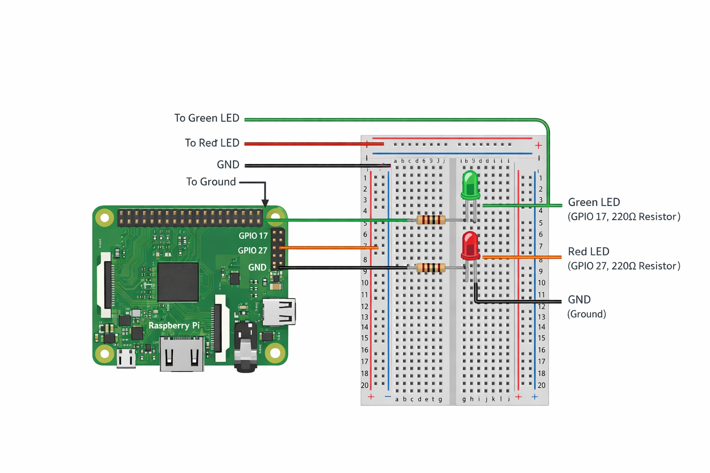

# Hardware Setup – Stock Alert System
This document covers all hardware-related configuration for the Stock Alert System, including LED wiring, GPIO pin usage, and hardware testing on a Raspberry Pi.

## Supported Hardware
- Raspberry Pi (tested on Raspberry Pi OS)
- GPIO-controlled LEDs
- Optional breadboard and resistors (220–330Ω recommended)
The system also supports a software-only mode where no hardware is required.

# LED Indicators
| LED Color | Meaning                            |
| --------- | ---------------------------------- |
| 🟢 Green  | Stock price is **above** target    |
| 🔴 Red    | Stock price is **below** target    |
| ⚪ Off     | Neutral / no alert / startup state |
Only one LED should be active at a time.

## GPIO Pin Mapping

Default GPIO configuration (BCM mode):
| LED | GPIO Pin                            |
| --------- | ---------------------------------- |
| 🟢 Green  | GPIO 17   |
| 🔴 Red    | GPIO 27    |

Pins can be changed in the configuration file or script constants.

## Wiring Diagram (Basic)
Each LED should be wired as follows:
- Anode (long leg) → GPIO pin through a resistor
- Cathode (short leg) → Ground (GND)

Example:
GPIO 17 → 220Ω resistor → Green LED → GND
GPIO 27 → 220Ω resistor → Red LED → GND

## Wiring Diagram

## Required Python Library
On Raspberry Pi:
sudo apt update
sudo apt install python3-rpi.gpio

The project automatically detects when GPIO is unavailable and runs in software-only mode.

## Hardware Test
To verify LEDs are working:
python3 stock_alert_hardware_test.py

Expected behavior:
- Green LED turns start to blink in sequence
- Red LED also starts to blink
- Buzzer start to beep

If LEDs do not light up: 
- Check pin numbers
- Confirm resistor orientation
- Verify GPIO permissions

## Running Without Hardware (DEV Mode)
- The system will not crash
- LED calls are safely ignored
- Console logs will show stock status instead
This allows development on laptops or non-Pi systems.

## Common Issues
ModuleNotFoundError: No module named 'RPi'
- You are not running on a Raspberry Pi
- This is expected in DEV mode

LEDs do not turn on
- Incorrect pin mapping
- Missing resistor
- Wrong GPIO numbering mode (must be BCM)

## Notes
- GPIO cleanup is handled automatically on shutdown
- LEDs reset to OFF on service restart
- Hardware is optional but recommended for real-time visual alerts

### End of hardware documentation.
